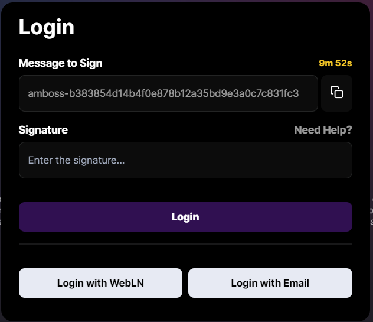

# webln.signMessage()

Request that the user signs an arbitrary string message.&#x20;

Signed messages can either be verified server-side using the LND RPC method, or by clients with [webln.verifyMessage](https://webln.dev/#/api/verify-message).

#### Method

```typescript
async function signMessage(message: string): SignMessageResponse;
```

#### Response

```typescript
interface SignMessageResponse {
  message: string;
  signature: string;
}
```

#### Code Example <a href="#demo" id="demo"></a>

```typescript
await webln.enable();
await webln.signMessage("Sample message"); 
```

#### Demo



****

**Example in the wild**

[https://amboss.space/](https://amboss.space/) uses `webln.signMessage()`for login. Users sign a message and prove ownership of a lightning node.

&#x20;****

****
